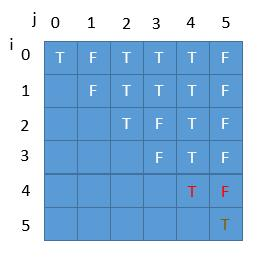
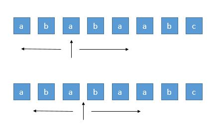

<center>最长回文子串 5</center>
给定一个字符串 s，找到 s 中最长的回文子串。你可以假设 s 的最大长度为 1000。

示例 1：

输入: "babad"
输出: "bab"
注意: "aba" 也是一个有效答案。
示例 2：

输入: "cbbd"
输出: "bb"

来源：力扣（LeetCode）
链接：https://leetcode-cn.com/problems/longest-palindromic-substring
著作权归领扣网络所有。商业转载请联系官方授权，非商业转载请注明出处。
### 题解
1.动态规划
我们定义：
$$
dp[i][j] = 
\begin{cases}
true,\qquad if dp[i - 1][j + 1] \&\& s[i] == s[j] \\
false,\qquad otherwise
\end{cases}
$$
```java
public String longestPalindrome(String s) {
    int n = s.length();
    String res = "
    boolean[][] dp = new boolean[n][n];
    for (int i = n - 1; i >= 0; i--) {
        for (int j = i + 1; j < n; j++) {
            dp[i][j] = s.charAt(i) == s.charAt(j) && (j - 2 < 0 || dp[i - 1][j + 1]);
            if (dp[i][j] && j - i + 1 > res.length()) {
                res = s.substring(i, j + 1);
            }
        }
    }
    return res;
}
```
如下图所示：


2.中心扩展
```java
puclic String longestPalindrome(String s) {
    if (s == null || s.length() == 0) return "";
    int start = 0, end = 0;
    for (int i = 0; i < s.length(); i++) {
        int lenExpandFromChar = expandAroudCenter(s, i , i);
        int lenExpandFromGarpe = expandAroudCenter(s, i , i + 1);
        int maxLen = Math.max(lenExpandFromChar, lenExpandFromGarpe);
        if (maxLen > end - start) {
            start = i - (maxLen - 1) / 2;
            end = i + maxLen / 2;
        }
    }
    return  s.substring(start, end + 1);
}

private int expandAroudCenter(String s, int start, int end) {
    int S = start, E = end;
    while (S >= 0 && E < s.length() && s.charAt(S) == s.charAt(E)) {
        S --;
        E ++;
    }
    return E - S - 1;
}
```
如图所示：


[参考链接](https://leetcode-cn.com/problems/longest-palindromic-substring/solution/xiang-xi-tong-su-de-si-lu-fen-xi-duo-jie-fa-bao-gu/)